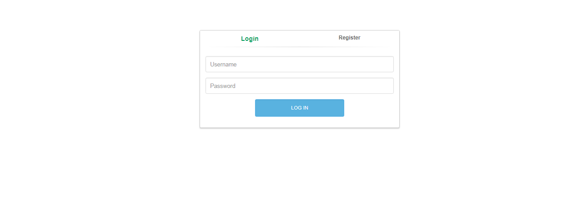
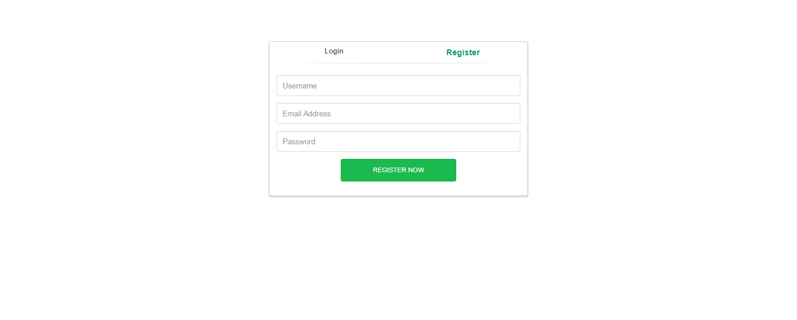
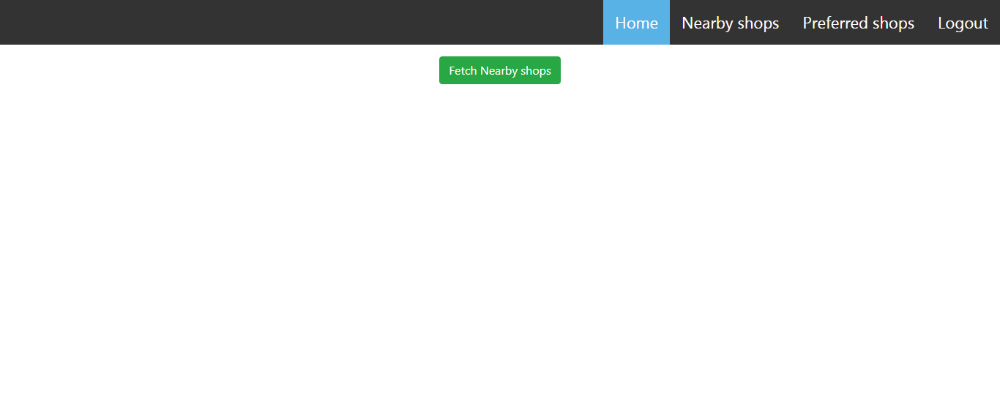
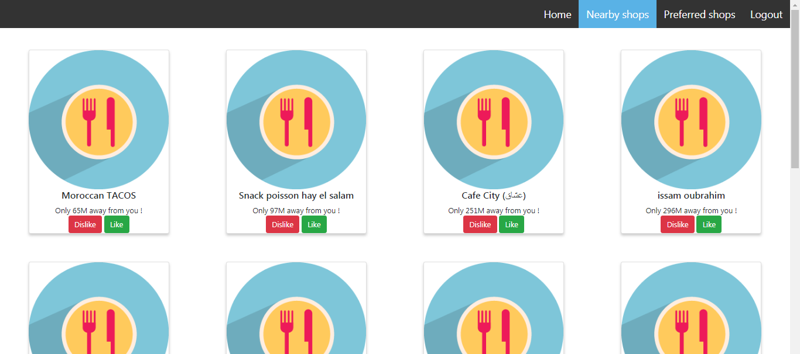
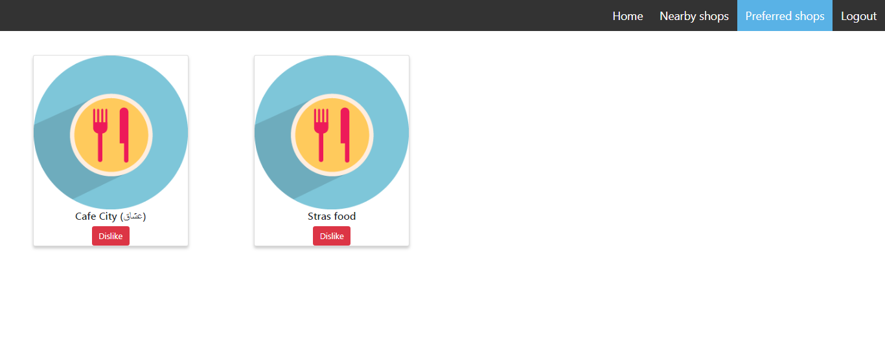

#**PRESENTATION**
**This is an app developed for a web coding challenge **.

_The web app is developed using_ :

*PURE OOP PHP (no framework included) .
*BOOTSTRAP.
*MYSQL.
*JAVASCRIPT.
*GOOGLE PLACES API (javascript SDK).

#**STRUCTURE OF THE FOLDERS**

[''
|-- API',
  '    |   |-- Init.js',
  '    |-- back',
  '    |   |-- Classes',
  '    |       |-- Athentification.php',
  '    |       |-- connexion.php',
  '    |       |-- DAO.php',
  '    |       |-- disconnect.php',
  '    |       |-- LikeDislike.php',
  '    |       |-- savePlaces.php',
  '    |       |-- submit.php',
  '    |       |-- MODELS',
  '    |           |-- Place.php',
  '    |           |-- User.php',
  '    |-- DBFolder',
  '    |   |-- urcc.sql',
  '    |-- front',
  '    |   |-- index.php',
  '    |   |-- Login.php',
  '    |   |-- NearbyShops.php',
  '    |   |-- PreferredShops.php',
  '    |   |-- css',
  '    |   |   |-- default.css',
  '    |   |   |-- login.css',
  '    |   |   |-- style.css',
  '    |   |-- img',
  '    |   |   |-- icon_rest.png',
  '    |   |-- js-scripts',
  '    |       |-- login-script.js',
  '    |-- README',
  '    |   |-- log.txt',
  '    |   |-- README.md',
  '    |-- ScreenShots',
  '        |-- 1.png',
  '        |-- 2.png',
  '        |-- 3.png',
  '        |-- 4.png',
  '        |-- 5.png',
  '' ]

*****************************************************************************************************************************************************
#**HOW TO USE IT** :

-IMPORT THE MYSQL DB FILE FROM : DBFolder 
-CHANGE THE DB NAME,USER,PWD IN THE /BACK/CLASSES/CONNEXION.PHP FILE .

-FIRE UP YOUR APACHE SERVER.

-LOGIN USING EITHER THE PRE DEFINED LOGIN & PWD : SPOCK , KIRKSUCK  || ZTF , XCFV  || MARCELINE , MARCELINE<3 

-ONCE LOGGED IN , YOU'LL BE REDIRECTED TO THE INDEX PAGE , CLICK ON THE FETCH NEARBY SHOPS .

-ONCE DONE ,YOU'LL BE REDIRECTED AGAIN TO NEARBYSHOPS PAGE 

-**THERE YOU CAN** : 

-LIKE : like a shop and add it to your favorits .

-DISLIKE(1) : the shop won't be visible until 2h has gone by .

-DISLIKE(2- in preferred shops): dislike an already liked shop to make it disapear from your list .

-####PLEASE CONSIDER REALOADING YOUR NEARBYSHOPS FOR BETTER USE OF THE FUNCTIONALITIES , SINCE THIS IS AN ASYNCHRONOUS APPROACHE I USED 

-CLICK HOME TO REFRESH YOUR NEARBY SHOPS.

-THE SHOPS WILL AUTOMATICALLY BE REMOVED ONCE YOU LOGGED OFF , SO IF YOU CHANGE YOUR LOCATION JUST SIGN OFF && SIGN IN OR RE-FETCH NEARBY SHOPS ONCE MORE .

-THE SHOPS UNLIKED IN THE NEARBY SHOPS PAGE WILL AUTOMATICALLY BE VISIBLE AFTER 2H .
-*****************************************************************************************************************************************************

-*****************************************************************************************************************************************************

######**for any further explanation please contact me @ Elatif.n@gmail.com || Devotor@protonmail.ch **
